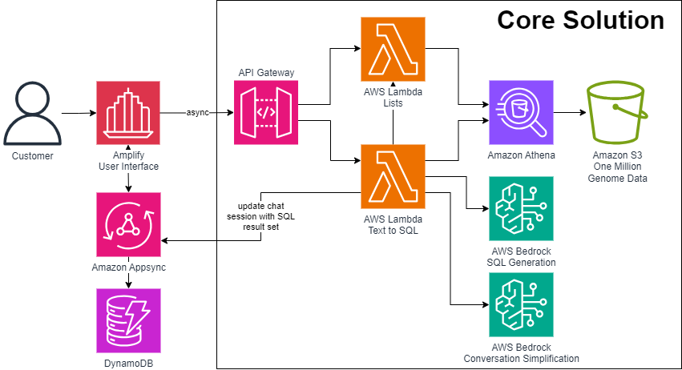

# Omics Text to SQL Backend

<details open="open">
<summary>Table of Contents</summary>

- [About](#about)
- [Requirements](#requirements)
- [Organization](#organization)
- [Configuration](#configuration)
- [Building and Publishing](#building-and-publishing)
- [License](#license)

</details>

## About

This repository maintains the artifacts necessary to build the full environment needed to run the Generative AI models
and provide services for the user interface. The CDK script deploys the text to SQL architecture.

### Architectures:
The primary architecture that is used by the system



* **API Gateway:** manages access to Lambda based services
* **Lambda: Lists:** Provides a mechanism to access gene names and gene variants in list form
* **Lambda Text to SQL** Receives user conversation and converts it into SQL then queries Athena
* **Athena:** Manages access to data stored in S3
* **Bedrock:** Serverless access to models
* **S3** Stores Genome data

### Amazon Services Used

* Amazon Amplify
* Amazon API Gateway
* Amazon Appsync
* Amazon Athena
* Amazon Bedrock
* Amazon DynamoDB
* Amazon Glue
* Amazon S3
* AWS Healthomics
* AWS Lambda


## Requirements

### System Requirements

#### Development tools:
* Docker 25.0.3
* Python 3.12
* Node 18.17.1
* CDK 2.133.0
* AWS CLI 2.13.17

### Deployment of the 1000Genome dataset with AWS Healthomics

In this repository, we implement a text-to-SQL framework to generate queries that works against the [1000Genome](https://www.internationalgenome.org/)
data deployed with the [AWS HealthOmics](https://docs.aws.amazon.com/omics/latest/dev/what-is-healthomics.html) project.

In order to deploy that dataset, the authors of this repository followed the steps in the [AWS HealthOmics workshop](https://catalog.workshops.aws/amazon-omics-end-to-end/en-US).
The most important pre-requisite is to have the steps of the [HealthOmics Analytics](https://catalog.workshops.aws/amazon-omics-end-to-end/en-US/010-xp-console/300-omics-analytics)
executed to create the variant stores and the annotation stores. 

In that workshop, the _clinvar_ annotation store is created. This sample code also contain prompts to generate SQL using the [gnomAD](https://aws.amazon.com/marketplace/pp/prodview-z4kk27u6t3nje?sr=0-1&ref_=beagle&applicationId=AWSMPContessa#overview) dataset as an additional annotation store. In order to do that, follow the same steps recommended in the HealthOmics workshop to create the _clinvar_ annotation store pointing to the respective Amazon S3 URIs containing the _gnomAD_ VCF files for each chromosome. As an example for chromosomes 1 and 2 the respective S3 URIs are: 

* `s3://gnomad-public-us-east-1/release/4.1/vcf/exomes/gnomad.exomes.v4.1.sites.chr1.vcf.bgz`
* `s3://gnomad-public-us-east-1/release/4.1/vcf/exomes/gnomad.exomes.v4.1.sites.chr2.vcf.bgz`


When creating resource links to provide reader friendly
table names, use the following names: _variants_, _gnomad_, and _clinvar_. The database should be called _omicsdb_. We also
recommend that you use _omicsathena_ as the Athena workgroup. 

Finally, make sure you follow the steps present in the [Using AWS CDK for Pandas](https://catalog.workshops.aws/amazon-omics-end-to-end/en-US/010-xp-console/300-omics-analytics/310-querying-data/aws-wrangler).
That tutorial contain details on how you must provide access to the IAM Role used by the AWS Lambda for the text-to-SQL
execution. The CDK deployment that is listed next will create the AWS Lambda, IAM Role and the policies needed to access
the resources that you created in this section. However, since the data will be registed in AWS Lake Formation, you must
grant _select_ and _describe_ permissions through the AWS Lake Formation console. The steps are the following:

1. From the AWS Lake Formation console, navigate to Tables 
1. Select the omicsvariants resource link you created earlier (Tip: its name will be in italics and its associated database will be omicsdb)
1. Select Actions > Grant on Target.
1. Under IAM roles and users select the role named "OmicsText2Sql-lambdastext2sqlRole-xxxxxxxxxxxxxxx". (Tip: type 
"Omics" in the search field to narrow down the list)
1. Under LF-Tags or catalog resources Verify that omicsvariantstore1 (or the variant store name that you provided) is 
selected under Tables - optional
1. Under Table Permissions, pick **Select and Describe**.
1. Finish with Grant


## Organization

### Source Structure
```
python-cdk
├── Configuration.py
├── __init__.py
├── components
│   ├── __init__.py
│   ├── api_gateway.py
│   ├── athena.py
│   ├── ec2.py
│   ├── lambdas.py
│   └── vpc.py
├── lambda
│   ├── __init__.py
│   ├── lists
│   │   ├── Dockerfile
│   │   ├── __init__.py
│   │   ├── handler.py
│   │   └── requirements.txt
│   └── text2sql
│       ├── Dockerfile
│       ├── __init__.py
│       ├── app
│       │   ├── __init__.py
│       │   ├── athena_connection.py
│       │   ├── chat_session.py
│       │   ├── llm_system_prompt.py
│       │   ├── logger_util.py
│       │   ├── main_sql_generator.py
│       │   ├── question_query_category_examples.py
│       │   ├── table_prompt.py
│       │   └── utils
│       │       ├── __init__.py
│       │       └── boto_clients.py
│       ├── conversation
│       │   ├── __init__.py
│       │   ├── conversation.py
│       │   ├── examples.txt
│       │   ├── prompt.txt
│       │   └── shots.json
│       ├── handler.py
│       └── requirements.txt
└── python_cdk_stack.py

7 directories, 34 files
```
### AWS Cloud Development Kit v2: lookbook_cdk

AWS CDK environment deployment and configuration scripting.

1. ```python_cdk/python_cdk_stack.py``` Primary CDK orchestration and management.
1. ```python_cdk/components/*``` Controls each aspect of cdk creation
1. ```cdk.json``` Basic CDK configuration

---

## Configuration

```python_cdk/configuration.json```
Set the target account number, region, and Amazon Athena details after you configured the AWS Healthomics Annotation 
Stores.

You will need to open the AWS Console and navigate to
the [Amazon Cognito](https://us-east-1.console.aws.amazon.com/cognito/v2/home?region=us-east-1) page and navigate
into `User Polls`. Next, copy the User Pool ID and paste in the configuration file below, along with the other Athena
references created by the deployment of the 1000 Genome dataset as explained in previous section.

```json
{
    "appname": "OmicsText2Sql",
    "account": "XXXXXXXXXXXXXX",
    "region": "us-east-1",

    "AthenaRegion": "us-east-1",
    "AthenaDatabase": "omicsdb",
    "AthenaWorkgroup": "omicsathena",
    "AthenaResultsBucket": "omics-output-us-east-1-XXXXXXXXXXXXXX",
    "AppSyncApiUrl": "https://XXXXXXXXXXXXXXXXXXXXXXX.appsync-api.us-east-1.amazonaws.com/graphql",
    "CognitoUserPoolId": "us-east-1_XXXXXXXXX"

}
```

```python_cdk/app.py```
Starting point for the deployment of the Text-to-SQL backend integrated with Athena.

We left some key test cases on the python code for the lambda functions. Please review those and use
a .env.local file for your local tests. The main properties that you need to configure after you
deployed the Amplify UI and the CDK code will look like the following:

```properties
AWS_REGION = us-east-1
ATHENA_DB = omicsdb
ATHENA_QUERY_RESULTS_BUCKET = omics-output-us-east-1-XXXXXXXXXXXXX
ATHENA_WORKGROUP = omicsathena
APP_SYNC_URL = https://XXXXXXXXXXXXXXXXXXXXXXX.appsync-api.us-east-1.amazonaws.com/graphql
```

---

## Building and Publishing

With the initialized CDK environment ([instructions here](https://docs.aws.amazon.com/cdk/v2/guide/getting_started.html))

**Steps:**
```bash
cd python_cdk/
cdk synth
cdk deploy
```

After the deployment is successful, go back to the [frontend](../frontend/README.md) instructions and
proceed from the `Environment Variables` section. You will need to copy and paste the API Gateway `sqlToTextBase` base 
API URL to the local environment variables file.

Follow additional guidelines in the [Welcome to your CDK Python project!](#welcome-to-your-cdk-python-project) 
section. 


# Welcome to your CDK Python project!

This is a blank project for CDK development with Python.

The `cdk.json` file tells the CDK Toolkit how to execute your app.

This project is set up like a standard Python project.  The initialization
process also creates a virtualenv within this project, stored under the `.venv`
directory.  To create the virtualenv it assumes that there is a `python3`
(or `python` for Windows) executable in your path with access to the `venv`
package. If for any reason the automatic creation of the virtualenv fails,
you can create the virtualenv manually.

To manually create a virtualenv on MacOS and Linux:

```
$ python -m venv .venv
```

After the init process completes and the virtualenv is created, you can use the following
step to activate your virtualenv.

```
$ source .venv/bin/activate
```

If you are a Windows platform, you would activate the virtualenv like this:

```
% .venv\Scripts\activate.bat
```

Once the virtualenv is activated, you can install the required dependencies.

```
$ pip install -r requirements.txt
```

At this point you can now synthesize the CloudFormation template for this code.

```
$ cdk synth
```

To add additional dependencies, for example other CDK libraries, just add
them to your `setup.py` file and rerun the `pip install -r requirements.txt`
command.

## Useful commands

* `cdk ls`          list all stacks in the app
* `cdk synth`       emits the synthesized CloudFormation template
* `cdk deploy`      deploy this stack to your default AWS account/region
* `cdk diff`        compare deployed stack with current state
* `cdk docs`        open CDK documentation

Enjoy!

